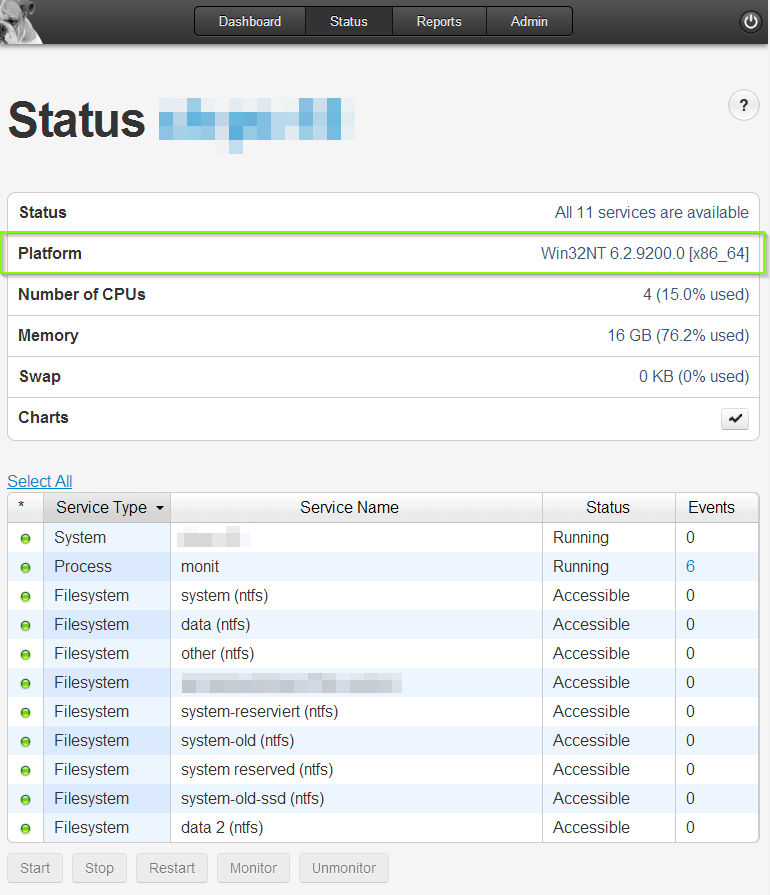
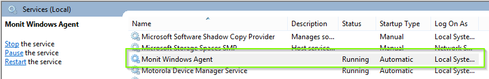

monit-windows-agent is a project that aims to re-implement a Windows <a href="http://mmonit.com/monit">Monit</a> Agent from scratch, with the primary goal to report to MMonit.

# Current Project Status #

## What already works: ##

 - Agent is already running on Command Line as well as a Windows Service
 - Agent Client is already reporting (pushing data) system status like CPU, HDD, Memory usage to MMonit
 - Agent Server is partly implemented and already responding to /_status?format=xml - request as well as to /_ping request

## What is still to do? ##

- Integration of Swap Memory status
- Agent must be made configurable for alerts
  - It's TBD if there should be a monitrc parser implemented in .NET, or if the configuration should happen in a totally different way (for e.g. via a prorpietary XML file)
  - Also a TODO is to find out whether the "controlfile" directive from the monitrc configuration is needed by the MMonit server, and if yes, what it does with it. That could limit our approach to utilize a proprietary configuration for the Windows Agent.
- Agent Server must respond to /_doAction - request and execute the according action

## Yeah, but where's the code? ##

### SHOW YOUR INTEREST! ###

- Before taking the time to put the code on GitHub and also to maintain it afterwards, I want to draw some attention on it
- I want to get some feedback if the Monit community really wants to have this Windows Client, and if some of you are willing to contribute.
- If no one cares, or if there's no demand, I won't publish this anytime soon.
- Use the issue tracker to show your demand: [https://github.com/derFunk/monit-windows-agent/issues/1](https://github.com/derFunk/monit-windows-agent/issues/1 "Demand Hub")

# Screenshots #
- MMonit view of the windows agent:

- Running monit windows service:

